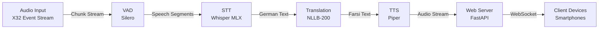

# Live Translation System

Real-time, offline-capable audio translation system designed for low-latency German to Farsi (Persian) translation in live event settings.

## 🚀 Key Features

*   **Real-time Processing**: Optimized pipeline for minimal latency (< 3s end-to-end).
*   **Offline Capability**: Runs entirely locally without external APIs, ensuring data privacy and reliability.
*   **Apple Silicon Optimized**: Leverages MLX and MPS (Metal Performance Shaders) for high-performance inference on Mac M1/M2/M3 chips.
*   **Smart VAD**: Integrated Voice Activity Detection to process only active speech segments.
*   **Mobile-First Client**: Lightweight web interface for users to tune in via their smartphones.

## 🏗 System Architecture

The system follows a linear processing pipeline orchestrated asynchronously:



## 🛠 Technical Stack

### Hardware Optimized For
*   **Platform**: Apple Silicon (M1 Max/Ultra recommended for production)
*   **RAM**: Minimum 16GB (32GB+ recommended)
*   **Audio Interface**: Compatible with CoreAudio (e.g., Behringer X32 via USB)

### core Components
*   **Speech-to-Text**: [Whisper](https://github.com/openai/whisper) running on [MLX](https://github.com/ml-explore/mlx) for Apple Silicon acceleration.
*   **Translation**: [NLLB-200](https://github.com/facebookresearch/fairseq/tree/nllb) (No Language Left Behind) via Hugging Face Transformers.
*   **Text-to-Speech**: [Piper](https://github.com/rhasspy/piper) for fast, low-resource neural TTS.
*   **Backend**: Python 3.10+ with FastAPI and AsyncIO.
*   **Frontend**: React + Vite (TypeScript).

## 📦 Installation

### Prerequisites
*   macOS 12.0+ (Monterey or later)
*   Python 3.10 or higher
*   Node.js 18+

### 1. Clone Repository
```bash
git clone https://github.com/flowtailor-de/live-translation.git
cd live-translation
```

### 2. Backend Setup
Create a virtual environment and install Python dependencies:
```bash
python3 -m venv venv
source venv/bin/activate

# Install requirements
pip install -r requirements.txt
```

### 3. Frontend Setup
Navigate to the UI directory and install dependencies:
```bash
cd ui
npm install
cd ..
```

### 4. Download Models
Run the setup script to download necessary models (Whisper, NLLB, Piper) to your local cache:
```bash
source venv/bin/activate
python -m src.download_models
```

## ⚙️ Configuration

The system is configured via `config.yaml`. Key settings:

```yaml
audio:
  device: "X32"        # Audio input device name substring
  sample_rate: 16000   # Standard for speech models

stt:
  device: "mlx"        # Use 'mlx' for Apple Silicon, 'cpu' for others
  model: "small"       # Balance between speed and accuracy

translation:
  source_lang: "deu_Latn"
  target_lang: "pes_Arab"
```

## 🚦 Usage

1.  **Start the Backend**:
    ```bash
    source venv/bin/activate
    python -m src.main
    ```

2.  **Start the Frontend** (Development):
    ```bash
    cd ui
    npm run dev
    ```
    *Client URL: http://localhost:5173 (or your network IP)*

3.  **Client Connection**:
    - Users connect their devices to the same Wi-Fi network.
    - Open the provided URL in a browser.
    - Click "Join Stream" to hear the live translation.

## 🔧 Troubleshooting

*   **Audio Device Not Found**: Ensure your audio interface is connected and recognized by macOS System Settings. Check the naming in `config.yaml`.
*   **Permission Denied**: The terminal/IDE needs microphone access permissions in macOS Privacy & Security settings.
*   **High Latency**: 
    - Ensure `stt.device` is set to `mlx`.
    - Reduce `vad.min_speech_duration` in config.
    - Use wired network connection for the server.

## 📄 License

Proprietary - FlowTailor
