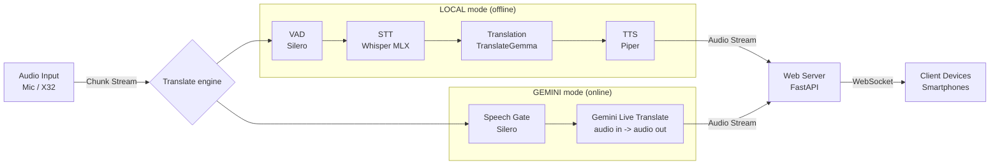

# Live Translation System

Real-time, offline-capable audio translation system designed for low-latency German to Farsi (Persian) translation in live event settings.

## 🚀 Key Features

*   **Real-time Processing**: Optimized pipeline for minimal latency (< 3s end-to-end).
*   **Offline Capability**: Runs entirely locally without external APIs, ensuring data privacy and reliability.
*   **Apple Silicon Optimized**: Leverages MLX and MPS (Metal Performance Shaders) for high-performance inference on Mac M1/M2/M3 chips.
*   **Smart VAD**: Integrated Voice Activity Detection to process only active speech segments.
*   **Mobile-First Client**: Lightweight web interface for users to tune in via their smartphones.

## 🏗 System Architecture

The system follows a linear processing pipeline orchestrated asynchronously:

The same **Capture** and **Broadcast** stages wrap two interchangeable **Translate**
engines (selected by `translation.backend`):


```mermaid
graph LR
    A[Audio Input\nMic / X32] -->|Chunk Stream| ENG{Translate engine}

    subgraph Local["LOCAL mode (offline)"]
        B[VAD\nSilero] --> C[STT\nWhisper MLX] --> D[Translation\nTranslateGemma] --> E[TTS\nPiper]
    end

    subgraph Gemini["GEMINI mode (online)"]
        G1[Speech Gate\nSilero] --> G2[Gemini Live Translate\naudio in -> audio out]
    end

    ENG --> B
    ENG --> G1
    E -->|Audio Stream| F[Web Server\nFastAPI]
    G2 -->|Audio Stream| F
    F -->|WebSocket| H[Client Devices\nSmartphones]
```

## 🛠 Technical Stack

### Hardware Optimized For
*   **Platform**: Apple Silicon (M1 Max/Ultra recommended for production)
*   **RAM**: Minimum 16GB (32GB+ recommended)
*   **Audio Interface**: Compatible with CoreAudio (e.g., Behringer X32 via USB)

### core Components
*   **Speech-to-Text**: [Whisper](https://github.com/openai/whisper) running on [MLX](https://github.com/ml-explore/mlx) for Apple Silicon acceleration.
*   **Translation**: [NLLB-200](https://github.com/facebookresearch/fairseq/tree/nllb) (No Language Left Behind) via Hugging Face Transformers.
*   **Text-to-Speech**: [Piper](https://github.com/OHF-Voice/piper1-gpl) for fast, low-resource neural TTS.
*   **Backend**: Python 3.10+ with FastAPI and AsyncIO.
*   **Frontend**: React + Vite (TypeScript).

## 📦 Installation

### Prerequisites
*   macOS 12.0+ (Monterey or later)
*   Python 3.10 or higher
*   Node.js 18+

### 1. Clone Repository
```bash
git clone https://github.com/flowtailor-de/live-translation.git
cd live-translation
```

### 2. Quick Setup (Recommended)
Run the automated setup script to install all dependencies and download models:
```bash
./bin/setup.sh
```

### 3. Alternative Manual Setup
If you prefer to set everything up manually:

**Backend:**
```bash
python3 -m venv venv
source venv/bin/activate
pip install -r requirements.txt
python -m src.download_models
```

**Frontend:**
```bash
cd ui
npm install
cd ..
```

## ⚙️ Configuration

The system is configured via `config.yaml`. Key settings:

```yaml
audio:
  device: "X32"        # Audio input device name substring
  sample_rate: 16000   # Standard for speech models

stt:
  device: "mlx"        # Use 'mlx' for Apple Silicon, 'cpu' for others
  model: "small"       # Balance between speed and accuracy

translation:
  source_lang: "deu_Latn"
  target_lang: "pes_Arab"
```

## 🌐 Translation Modes

The system has two interchangeable translation engines. Audio capture and the
web/phone broadcast are identical in both — only the middle "translate" stage
differs. Switch via the **Model Backend** dropdown in the launcher, or
`translation.backend` in `config.yaml`.

| Mode | `backend` value | Runs | Needs |
| --- | --- | --- | --- |
| **Local** (default) | `translategemma-mlx`, `nllb`, … | Fully offline on your Mac (Whisper → translate → Piper) | Nothing online |
| **Gemini Live** | `gemini-live` | Google's Gemini Live Translate over the internet | API key + connection |

**Enabling Gemini Live mode:**

1. Copy `.env.example` to `.env` and set `GEMINI_API_KEY=...`
   (get a key at https://aistudio.google.com/apikey).
2. Set `translation.backend: gemini-live` (or pick `gemini-live` in the launcher).
3. `target_lang` sets the output language. The **source language is auto-detected**,
   so the Source dropdown is ignored in this mode. The spoken voice is Google's
   (not the local Piper voice), and connections auto-reconnect for long events.

**Cost & the speech gate:** Gemini Live Translate is billed per second of audio
(input ~$0.0053/min, output ~$0.0315/min). To avoid paying to stream silence, a
**speech gate** (`gemini.vad_gating`, on by default) sends audio only while someone
is speaking. For a 2-hour session with ~35 min of actual speech, expect roughly
**$1–1.50** (output audio dominates). Tune `gate_pre_roll` / `gate_hangover` if the
start or end of sentences gets clipped.

## 🚦 Usage

1.  **One-Click Start**:
    ```bash
    ./bin/start.sh
    ```
    This launches both the Python backend and React frontend.

2.  **Access the Interface**:
    - Open `http://localhost:5173` on your computer.
    - Connect mobile devices to the same Wi-Fi network and look for the IP address printed in the terminal.

3.  **Manual Start (Dev Mode)**:
    If you need to run services separately:
    ```bash
    # Terminal 1: Backend
    source venv/bin/activate
    python -m src.main

    # Terminal 2: Frontend
    cd ui
    npm run dev
    ```

## 🔧 Troubleshooting

*   **Audio Device Not Found**: Ensure your audio interface is connected and recognized by macOS System Settings. Check the naming in `config.yaml`.
*   **Permission Denied**: The terminal/IDE needs microphone access permissions in macOS Privacy & Security settings.
*   **High Latency**: 
    - Ensure `stt.device` is set to `mlx`.
    - Reduce `vad.min_speech_duration` in config.
    - Use wired network connection for the server.

## 📄 License

Proprietary - FlowTailor
